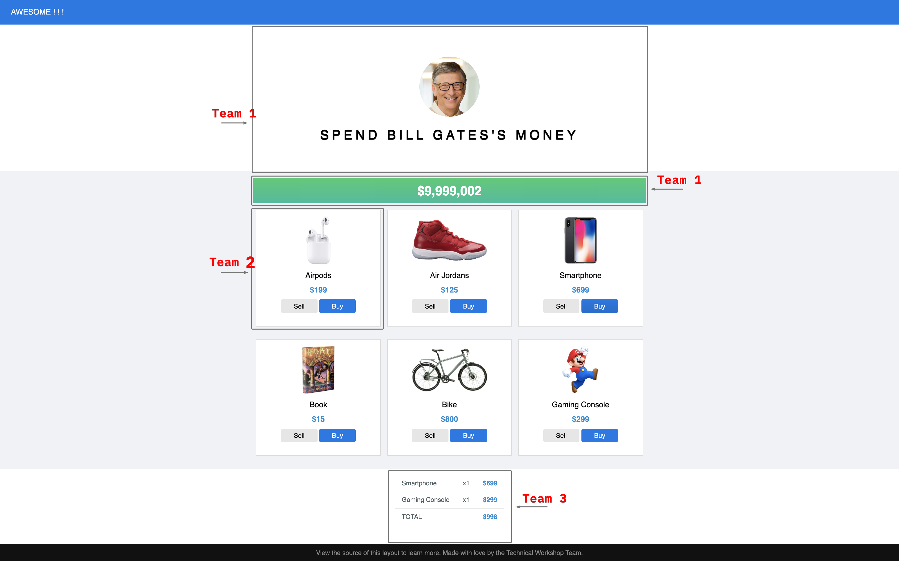

# micro-frontend-team-two
## Micro frontend process
[View the process here..](documentation/micro_frontend_process.svg)
## Challenge
Inspired by https://neal.fun/spend/

Bill Gates is one of billionaires in the world. He's very rich. He has a lot of money. For that reason, today we will together help him spent his money on our application.

As the workshop organizer, we want to build an application with ONE main features is sell / buy the product which will have some requirements:
1. Display Bill remaining money after _buy / sell_ some products.
2. Display a list of products, each product should have _buy / sell_ action.
3. Show and update the receipt on every _buy / sell_ action.

We decide that the application is splited into multiple fragments.  
So that all the teams can work indepently and the team do their fragment freely choose the framework they want.